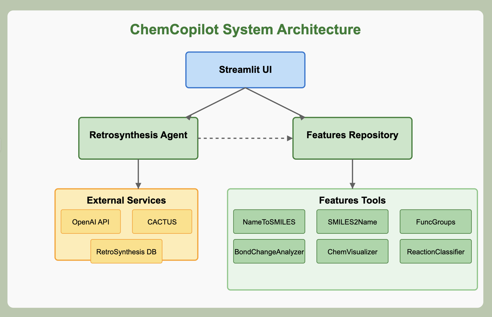
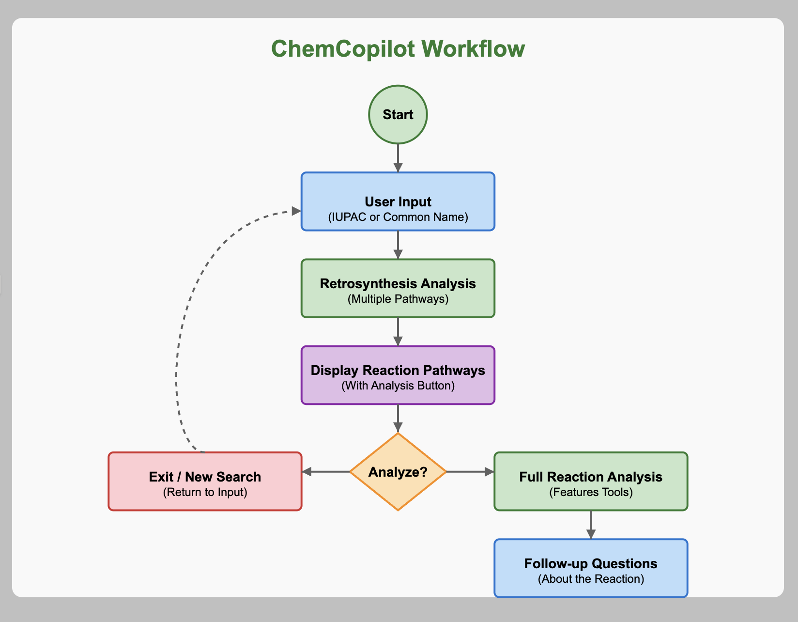

# ChemCopilot - Chemistry Assistant

ChemCopilot is an advanced chemistry assistant designed for analyzing chemical reactions and performing retrosynthesis analysis. This tool provides chemists with comprehensive information about reactions, including bond changes, functional group transformations, visualization, and more.

## 🧪 Overview

ChemCopilot combines two powerful components:
- **Features Repository** - A collection of chemistry analysis tools using LangChain and GPT-4o
- **RetroSynthesis Agent** - A service for generating synthetic pathways for chemical compounds

The application provides a user-friendly web interface through Streamlit where users can search for compounds, view retrosynthesis pathways, and analyze individual reactions in detail.

## 🛠️ System Architecture



ChemCopilot consists of two main components that work together:
- **Features Repository**: Contains the core chemistry analysis tools and the web interface
- **RetroSynthesis Agent**: A separate service for generating synthetic pathways

## 📋 Prerequisites

- Python 3.11
- Conda (recommended for environment management)
- OpenAI API key
- Git

## ⚙️ Installation

### Step 1: Clone the ChemCopilot Repository
```bash
git clone https://github.com/yourusername/chemcopilot.git
cd chemcopilot
```

### Step 2: Create and Activate a Conda Environment
```bash
conda create -n retrosyn python=3.11
conda activate retrosyn
```

### Step 3: Clone the RetroSynthesis Agent Repository
```bash
# Inside the chemcopilot directory
git clone https://github.com/anujmst/RetroSynthesisAgent.git
```

### Step 4: Set Up RetroSynthesis Agent
Follow the instructions at: https://github.com/anujmst/RetroSynthesisAgent

### Step 5: Configure the Features Repository
Create a `.env` file in the main directory:
```
OPENAI_API_KEY=your_openai_api_key_here
```

Install the required packages:
```bash
pip install -r requirements.txt
```

## 🚀 Running the Application

1. Start the RetroSynthesis Agent service (follow the instructions from the RetroSynthesis Agent repository)
2. In a new terminal, start the ChemCopilot web interface:
```bash
conda activate retrosyn
cd ..
cd Features
python -m streamlit run app.py
```
3. Open your browser and navigate to http://localhost:8501

## 📊 Tools and Features

ChemCopilot integrates several specialized chemistry tools:

### RetroSynthesis
- Searches for synthesis pathways for a target compound
- Returns reaction steps, conditions, and SMILES notation

### FuncGroups
- Identifies functional groups in molecules or reactions
- Analyzes functional group transformations

### NameToSMILES
- Converts chemical names (IUPAC or common) to SMILES notation

### SMILES2Name
- Converts SMILES strings to chemical names
- Provides both IUPAC and common names when available

### BondChangeAnalyzer
- Identifies bonds broken, formed, and changed in reactions
- Explains bond transformation patterns

### ChemVisualizer
- Generates visual representations of molecules and reactions
- Creates clear reaction diagrams showing transformations

### ReactionClassifier
- Classifies reaction types based on reaction SMILES
- Provides educational information about reaction mechanisms

## 🔄 Workflow



1. **Input**: User enters a compound name or reaction SMILES
2. **Retrosynthesis**: System generates synthesis pathways (if compound name entered)
3. **Reaction Selection**: User selects a reaction of interest
4. **Analysis**: System provides comprehensive analysis of the selected reaction
5. **Follow-up**: User can ask specific questions about the reaction

## 🗂️ Key Files

### app.py
The main Streamlit application that provides the web interface for interacting with ChemCopilot. It handles:
- User input processing
- Retrosynthesis pathway display
- Reaction selection and analysis
- Follow-up questioning about specific reactions

### test.py
Contains the enhanced_query function that coordinates the analysis pipeline:
- Processes user queries about reactions
- Calls appropriate chemistry tools based on query intent
- Generates comprehensive reaction analyses
- Handles visualization requests

## 🔄 Data Flow

1. User Input → Query Processing
2. Compound Name → RetroSynthesis API → Pathway Results
3. Reaction SMILES → Chemistry Tools → Analysis Results
4. Results → Visualization → User Interface

## 🧩 Component Diagram - Features Repository

The Features Repository consists of:

### Web Interface Layer
- Streamlit application (app.py)
- User input handling
- Results visualization

### Query Processing Layer
- Query analyzer (test.py)
- Tool selection logic
- Response formatting

### Tools Layer
- Chemistry analysis tools
- Visualization components
- API integrations

## 💻 Usage Examples

### Retrosynthesis Search
1. Enter a compound name (e.g., "flubendiamide")
2. Click "Search Retrosynthesis"
3. View and explore the generated synthesis pathways

### Reaction Analysis
1. Select a reaction from the retrosynthesis results
2. View comprehensive analysis including:
   - Reaction visualization
   - Functional group changes
   - Bond transformations
   - Reaction mechanism
   - Applications

### Follow-up Questions
1. After viewing a reaction analysis, use the question box
2. Ask specific questions about the reaction
3. Get tailored answers about mechanisms, applications, etc.

## 📝 Important Notes

- Both components require Python 3.11
- The RetroSynthesis Agent must be running for the retrosynthesis functionality to work
- A valid OpenAI API key is required for the GPT-4o powered analysis tools
- Reaction visualizations are generated on-the-fly and saved to the local filesystem

## 🔍 Troubleshooting

- If the retrosynthesis feature doesn't work, ensure the RetroSynthesis Agent service is running
- Check the .env file if experiencing authentication errors with the OpenAI API
- For visualization issues, ensure you have appropriate permissions to write to the filesystem

## 🤝 Contributing

Contributions are welcome! Please feel free to submit a Pull Request.

## 📜 License

This project is licensed under the MIT License - see the LICENSE file for details.

<!--
Note: To properly display the diagrams, please save the following images:
1. Save the system architecture diagram as "images/system_architecture.png"
2. Save the workflow diagram as "images/workflow.png"
-->
